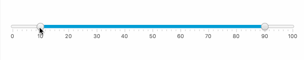

# MultiRange Custom Control

MultiRange is a JavaFX control similar to the default Slider control but with support for any number of thumbs (always in pairs).

Any number of ranges can be added to the slider (if there is enought space...).

--

<b>MultiRange Control</b></br></br>


## Create programatically

```Java
// Create a new MultiRange with min/max values
MultiRange multiRange = new MultiRange(0, 100);

// Show tick marks and tick labels
multiRange.setShowTickLabels(true);
multiRange.setShowTickMarks(true);

// Set major tick unit and minor tick count
multiRange.setMajorTickUnit(2);
multiRange.setMinorTickCount(10);

// Make it snap to ticks
multiRange.setSnapToTicks(true);

```

## Create with FXML

```xml
<?import multirange.MultiRange?>
...
<AnchorPane>
   <children>
      <MultiRange fx:id="multiRange" stylesheets="@./multirange.css"/>
   </children>
</AnchorPane>

```

## Installation

### Maven


### Manual

